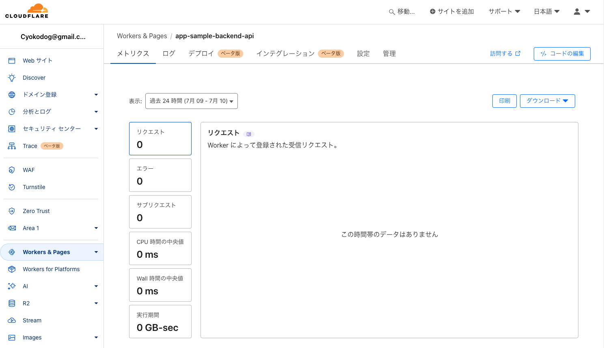
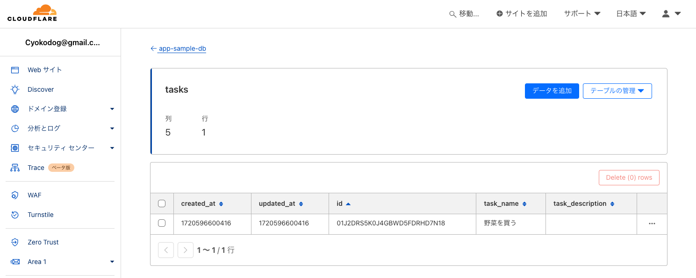

## Backend API

本パッケージでは、テーブルへのレコードの追加等を行う API を提供します。

API の起動をローカルで行うには`dev --persist-to`を次のように指定します。

```sh
wrangler dev --persist-to ../../.wrangler/state --port 8686
```

これで API を呼びだせるようになったので、curl でテストしてみます。

```sh
curl http://localhost:8686/v1/tasks/create \
  -X POST \
  -d '{"taskName": "野菜を買う"}'

curl http://localhost:8686/v1/tasks/create \
  -X POST \
  -d '{"taskName": "肉を買う", "taskDescription": "牛肉と豚肉を買う"}'
```

`d1 execute`で SQL を実行しレコードが生成されたことを確認します。

```sh
wrangler d1 execute app-sample-db  --local --persist-to ../../.wrangler/state --command "SELECT * FROM tasks"


 ⛅️ wrangler 3.28.2 (update available 3.63.2)
-------------------------------------------------------
🌀 Mapping SQL input into an array of statements
🌀 Executing on local database app-sample-db (38ba3ddb-597f-4ca1-8040-d3bde4063024) from ../../.wrangler/state/v3/d1:
┌───────────────┬───────────────┬────────────────────────────┬───────────┬──────────────────┐
│ created_at    │ updated_at    │ id                         │ task_name │ task_description │
├───────────────┼───────────────┼────────────────────────────┼───────────┼──────────────────┤
│ 1712735344259 │ 1712735344259 │ 01HV3FPNM3MVBWA9SXJ6F6J0DZ │ Task Name │ Task Description │
├───────────────┼───────────────┼────────────────────────────┼───────────┼──────────────────┤
│ 1712736965863 │ 1712736965863 │ 01HV3H85755K4EEGBYZ123R0A4 │ 野菜を買う     │                  │
├───────────────┼───────────────┼────────────────────────────┼───────────┼──────────────────┤
│ 1712737146738 │ 1712737146738 │ 01HV3HDNVHNGK1J036GSYF4MXF │ 肉を買う      │ 牛肉と豚肉を買う         │
└───────────────┴───────────────┴────────────────────────────┴───────────┴──────────────────┘
```

## Backend API をデプロイする

`wrangler deploy`コマンドで、Backend API をデプロイする。

```
wrangler deploy

 ⛅️ wrangler 3.28.2 (update available 3.63.2)
-------------------------------------------------------
Your worker has access to the following bindings:
- D1 Databases:
  - DB: app-sample-db (38ba3ddb-597f-4ca1-8040-d3bde4063024), Preview: (38ba3ddb-597f-4ca1-8040-d3bde4063024)
Total Upload: 243.92 KiB / gzip: 46.23 KiB
Uploaded app-sample-backend-api (2.23 sec)
Published app-sample-backend-api (3.92 sec)
  https://app-sample-backend-api.cyokodog.workers.dev
Current Deployment ID: 8ca8b41e-e1f7-4b2e-9085-d6bad8485b92
```

上記を見ると、`https://app-sample-backend-api.cyokodog.workers.dev`にデプロイされたことがわかります。Cloudflare のダッシュボードからも次のように確認できます。



先ほどローカル環境で試したように、デプロイした Backend API を使いレコードを作成してみます。

```sh
curl https://app-sample-backend-api.cyokodog.workers.dev/v1/tasks/create \
 -X POST \
 -d '{"taskName": "野菜を買う"}'
```

SQL でレコードが登録されたことを確認します。

```sh
wrangler d1 execute app-sample-db  --command "SELECT * FROM tasks"

 ⛅️ wrangler 3.28.2 (update available 3.63.2)
-------------------------------------------------------
🌀 Mapping SQL input into an array of statements
🌀 Parsing 1 statements
🌀 Executing on remote database app-sample-db (38ba3ddb-597f-4ca1-8040-d3bde4063024):
🌀 To execute on your local development database, pass the --local flag to 'wrangler d1 execute'
🚣 Executed 1 commands in 0.1908ms
┌───────────────┬───────────────┬────────────────────────────┬───────────┬──────────────────┐
│ created_at    │ updated_at    │ id                         │ task_name │ task_description │
├───────────────┼───────────────┼────────────────────────────┼───────────┼──────────────────┤
│ 1720596600416 │ 1720596600416 │ 01J2DRS5K0J4GBWD5FDRHD7N18 │ 野菜を買う  │                  │
└───────────────┴───────────────┴────────────────────────────┴───────────┴──────────────────┘
```

Cloudflare のダッシュボードからも、レコードが登録されたことを確認できます。


