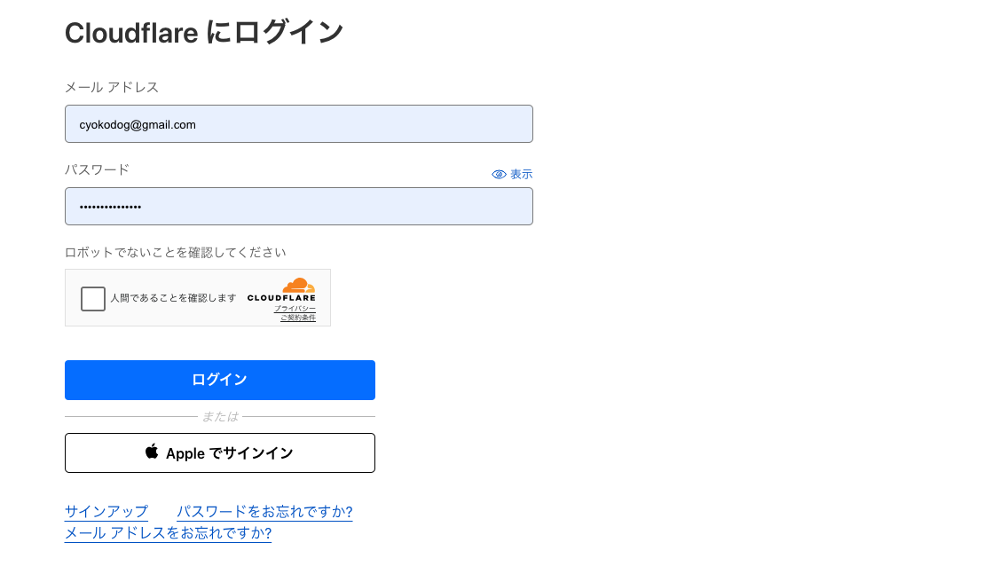
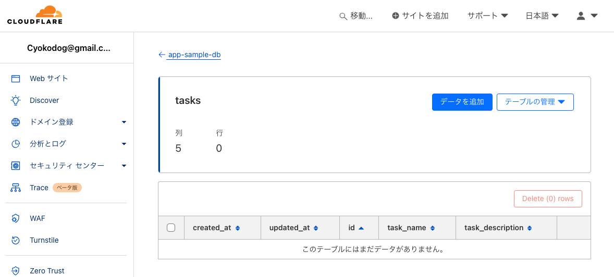

## Cloudflare アカウントと Wrangler の準備

Cloudflare にアカウントを作成し、wrangler をインストールした後にログインする。

```
npm i -g wrangler
wrangler -v
wrangler login
```

ブラウザが立ち上がり、次の画面が表示される。



`wrangler whoami`コマンドで、アカウント ID をはじめとしたログインユーザーの情報を確認できる。

```
⛅️ wrangler 3.28.2 (update available 3.63.2)
-------------------------------------------------------
Getting User settings...
👋 You are logged in with an OAuth Token, associated with the email cyokodog@gmail.com!
┌──────────────────────────────┬──────────────────────────────────┐
│ Account Name                 │ Account ID                       │
├──────────────────────────────┼──────────────────────────────────┤
│ Cyokodog@gmail.com's Account │ xxxxxxxxxxxxxxxxxxxxxxxxxxxxxxxx │
└──────────────────────────────┴──────────────────────────────────┘
🔓 Token Permissions: If scopes are missing, you may need to logout and re-login.
Scope (Access)
- account (read)
- user (read)
- workers (write)
- workers_kv (write)
- workers_routes (write)
- workers_scripts (write)
- workers_tail (read)
- d1 (write)
- pages (write)
- zone (read)
- ssl_certs (write)
- constellation (write)
- ai (read)
- offline_access
```

## D1 にサンプル用の DB 作成

```
wrangler d1 create app-sample-db

 ⛅️ wrangler 3.28.2 (update available 3.48.0)
-------------------------------------------------------
✅ Successfully created DB 'app-sample-db' in region APAC
Created your database using D1's new storage backend. The new storage backend is not yet recommended for production workloads,
but backs up your data via point-in-time restore.

[[d1_databases]]
binding = "DB" # i.e. available in your Worker on env.DB
database_name = "app-sample-db"
database_id = "xxxxxxxx-xxxx-xxxx-xxxx-xxxxxxxxxxxx"
```

wrangler.toml を作成して以下を転記する。

```
[[d1_databases]]
binding = "DB" # i.e. available in your Worker on env.DB
database_name = "app-sample-db"
database_id = "xxxxxxxx-xxxx-xxxx-xxxx-xxxxxxxxxxxx"
```

`binding = "DB"`となっていることから、ワーカー内からは`env.DB`を通じ DB にアクセスできる。
`database_name = "app-sample-db"`は、DB の名前であり、Cloudflare のダッシュボードからこの名前の DB が作成されたことが確認できる。

次のコマンドで DB 内のテーブルを確認できる。

```
wrangler d1 execute app-sample-db --command "SELECT name FROM sqlite_schema WHERE type ='table'"

 ⛅️ wrangler 3.28.2 (update available 3.48.0)
-------------------------------------------------------
🌀 Mapping SQL input into an array of statements
🌀 Parsing 1 statements
🌀 Executing on remote database app-sample-db (38ba3ddb-597f-4ca1-8040-d3bde4063024):
🌀 To execute on your local development database, pass the --local flag to 'wrangler d1 execute'
🚣 Executed 1 commands in 0.3047ms
┌────────┐
│ name   │
├────────┤
│ _cf_KV │
└────────┘
```

## テーブルを生成する DDL の作成

例えば`./schemas/user.sql`というファイルに DDL を記述し、以下のコマンドでテーブルを作成することもできるが、

```
wrangler d1 execute d1-example --file schemas/users.sql
```

ここでは`drizzle`という ORM を使い、実装用のテーブル定義から DDL を生成する。必要な実装は以下の通り。

- src/database/schema.ts
  - drizzle ベースでテーブル定義を記述
- drizzle.config.ts
  - drizzle の設定ファイル

これで`package.json`に以下のスクリプトを`npm run generate`で実行することで、`migrations`ディレクトリに DDL が記述された`***.sql`ファイルが生成される（`***`部分はランダムな文字列になる）。

```
  "scripts": {
    "generate": "drizzle-kit generate:sqlite --config ./drizzle.config.ts"
  },
```

## マイグレーションの実行

DDL は上述の通り`--file`で生成された`.sql`を指定することでも実行できるが、`wrangler d1 migrations`コマンドでも実行できる。この場合は、実行されたマイグレーションの情報が DB に記録されるため、再実行時にはスキップされる。つまり、常に新規に作成されたマイグレーションのみが実行されることになる。

また、DB は Cloudflare 上のみでなく、次のように`--local --persist-to`を指定することでローカルに作成することができるので、まずはローカルで試して見るとよい。

```
wrangler d1 migrations apply app-sample-db --local --persist-to ../../.wrangler/state
```

`--persist-to ../../.wrangler/state`は、モノレポ構成のプロジェクトルートに`.wrangler/state`ディレクトリを作成し、ローカル DB を生成することを意味する。つまり`--persist-to ../../.wrangler`ディレクトリをまるごと削除すれば、ローカル DB が削除されるため再度作り直すこともできる。

また、前述の`select`文に`--local --persist-to`を付与することで、ローカル DB に生成されたテーブルを確認できる。

```
wrangler d1 execute app-sample-db  --local --persist-to ../../.wrangler/state --command "SELECT name FROM sqlite_schema WHERE type ='table'"

⛅️ wrangler 3.28.2 (update available 3.48.0)
-------------------------------------------------------
🌀 Mapping SQL input into an array of statements
🌀 Executing on local database app-sample-db (xxxxxxxx-xxxx-xxxx-xxxx-xxxxxxxxxxxx) from ../../.wrangler/state/v3/d1:
┌─────────────────┐
│ name            │
├─────────────────┤
│ _cf_KV          │
├─────────────────┤
│ d1_migrations   │
├─────────────────┤
│ sqlite_sequence │
├─────────────────┤
│ tasks           │
└─────────────────┘
```

d1_migrations、sqlite_sequence は、自動で生成されるテーブルであり、`tasks`は`drizzle`で生成されたテーブルである。

### Cloudflare 上の DB にマイグレーションを適用する

Cloudflare 上の DB にマイグレーションを適用するには、上述の`--local --persist-to`を外すだけでよい。

```
wrangler d1 migrations apply app-sample-db

 ⛅️ wrangler 3.28.2 (update available 3.63.2)
-------------------------------------------------------
Migrations to be applied:
┌─────────────────────────┐
│ name                    │
├─────────────────────────┤
│ 0000_numerous_freak.sql │
└─────────────────────────┘
✔ About to apply 1 migration(s)
Your database may not be available to serve requests during the migration, continue? … yes
🌀 Mapping SQL input into an array of statements
🌀 Parsing 2 statements
🌀 Executing on remote database app-sample-db (38ba3ddb-597f-4ca1-8040-d3bde4063024):
🌀 To execute on your local development database, pass the --local flag to 'wrangler d1 execute'
🚣 Executed 2 commands in 1.1104ms
┌─────────────────────────┬────────┐
│ name                    │ status │
├─────────────────────────┼────────┤
│ 0000_numerous_freak.sql │ ✅     │
└─────────────────────────┴────────┘
```

同様に`--local --persist-to`を外すして SQL を実行すれば、Cloudflare 上の DB に生成されたテーブルを確認できる。

```
wrangler d1 execute app-sample-db --command "SELECT name FROM sqlite_schema WHERE type ='table'"

 ⛅️ wrangler 3.28.2 (update available 3.63.2)
-------------------------------------------------------
🌀 Mapping SQL input into an array of statements
🌀 Parsing 1 statements
🌀 Executing on remote database app-sample-db (38ba3ddb-597f-4ca1-8040-d3bde4063024):
🌀 To execute on your local development database, pass the --local flag to 'wrangler d1 execute'
🚣 Executed 1 commands in 0.2074ms
┌─────────────────┐
│ name            │
├─────────────────┤
│ _cf_KV          │
├─────────────────┤
│ d1_migrations   │
├─────────────────┤
│ sqlite_sequence │
├─────────────────┤
│ tasks           │
└─────────────────┘
```

Cloudflare 上のダッシュボードからもテーブルが作成されていることが確認できる。


